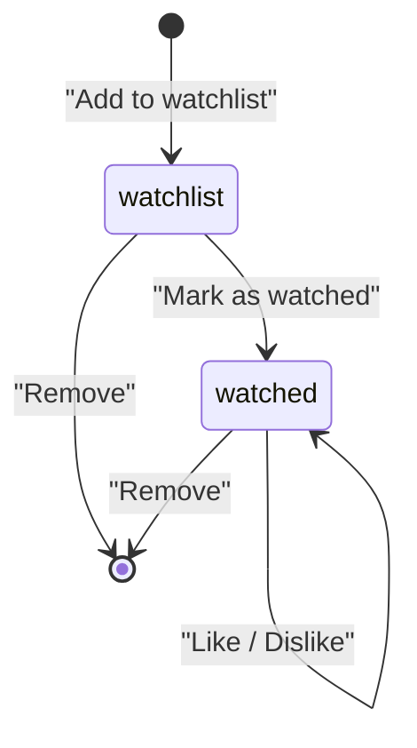

# TasteGraph — Prompt-driven Library System Extension

> Core component extending the MVP. Replaces the simple watchlist/interactions tables.

---

## 1. LIBRARY SYSTEM DESIGN

### Unified State Model

Every movie in a user's library has **one status** and **one optional sentiment**:

```
Status:    watchlist | watched
Sentiment: liked | disliked | null (neutral/no signal)
```

No separate tables for watchlist vs watched vs liked. Single `library_items` table, filtered by status.

### State Transitions



- `watchlist → watched`: Sets `status=watched`, `watched_at=now()`
- `watched → liked`: Sets `sentiment=liked`
- `watched → disliked`: Sets `sentiment=disliked`
- Any → removed: Hard delete from `library_items`, log to `interactions`

### Interaction Logging

Every mutation logs to `interactions` (append-only event log). This feeds the embedding pipeline.

```
add_watchlist → weight: +0.3
mark_watched → weight: +0.5
like         → weight: +1.0
dislike      → weight: -1.0
remove       → weight: -0.2
```

---

## 2. DATA MODEL

### Migration: Drop old tables, add new ones

```sql
-- Drop old MVP tables (replaced by library system)
DROP TABLE IF EXISTS watchlist;
DROP TABLE IF EXISTS interactions;

-- Enable trigram extension for fuzzy matching
CREATE EXTENSION IF NOT EXISTS pg_trgm;

-----------------------------------------------------------
-- LIBRARY ITEMS (unified user↔movie state)
-----------------------------------------------------------
CREATE TABLE library_items (
    id          UUID PRIMARY KEY DEFAULT uuid_generate_v4(),
    user_id     UUID NOT NULL REFERENCES users(id) ON DELETE CASCADE,
    movie_id    UUID NOT NULL REFERENCES movies(id) ON DELETE CASCADE,
    status      VARCHAR(20) NOT NULL DEFAULT 'watchlist'
                CHECK (status IN ('watchlist', 'watched')),
    sentiment   VARCHAR(20) DEFAULT NULL
                CHECK (sentiment IN ('liked', 'disliked', NULL)),
    added_at    TIMESTAMPTZ DEFAULT NOW(),
    watched_at  TIMESTAMPTZ,
    updated_at  TIMESTAMPTZ DEFAULT NOW(),
    UNIQUE(user_id, movie_id)
);

-- Primary query patterns
CREATE INDEX idx_lib_user_status ON library_items(user_id, status);
CREATE INDEX idx_lib_user_sentiment ON library_items(user_id, sentiment)
    WHERE sentiment IS NOT NULL;
CREATE INDEX idx_lib_movie ON library_items(movie_id);
CREATE INDEX idx_lib_updated ON library_items(updated_at DESC);

-----------------------------------------------------------
-- INTERACTIONS (append-only event log)
-----------------------------------------------------------
CREATE TABLE interactions (
    id          UUID PRIMARY KEY DEFAULT uuid_generate_v4(),
    user_id     UUID NOT NULL REFERENCES users(id) ON DELETE CASCADE,
    movie_id    UUID NOT NULL REFERENCES movies(id) ON DELETE CASCADE,
    action      VARCHAR(30) NOT NULL,
                -- 'add_watchlist','mark_watched','like','dislike','remove','unlike'
    weight      FLOAT NOT NULL,         -- signal strength for embedding updates
    metadata    JSONB DEFAULT '{}',     -- source: 'prompt','manual','bulk_import'
    created_at  TIMESTAMPTZ DEFAULT NOW()
);

CREATE INDEX idx_interactions_user ON interactions(user_id, created_at DESC);
CREATE INDEX idx_interactions_user_movie ON interactions(user_id, movie_id);

-----------------------------------------------------------
-- MOVIE TITLE INDEX (for fuzzy matching)
-----------------------------------------------------------
CREATE INDEX idx_movies_title_trgm ON movies
    USING gin (title gin_trgm_ops);
CREATE INDEX idx_movies_title_lower ON movies (LOWER(title));
```

### SQLAlchemy Model

```python
# app/models/library.py
class LibraryItem(Base):
    __tablename__ = "library_items"

    id = Column(UUID, primary_key=True, default=uuid4)
    user_id = Column(UUID, ForeignKey("users.id", ondelete="CASCADE"), nullable=False)
    movie_id = Column(UUID, ForeignKey("movies.id", ondelete="CASCADE"), nullable=False)
    status = Column(String(20), nullable=False, default="watchlist")
    sentiment = Column(String(20), nullable=True)
    added_at = Column(DateTime(timezone=True), server_default=func.now())
    watched_at = Column(DateTime(timezone=True), nullable=True)
    updated_at = Column(DateTime(timezone=True), server_default=func.now(), onupdate=func.now())

    __table_args__ = (UniqueConstraint("user_id", "movie_id"),)

    movie = relationship("Movie", lazy="joined")
```

---

## 3. PROMPT → ACTION PARSER

### Approach: Regex + keyword rules (no LLM dependency)

The command set is small and predictable (~6 intents), so regex is the right tool.

```python
# app/services/prompt_parser.py
import re
from dataclasses import dataclass

INTENT_PATTERNS = [
    # (pattern, action, sentiment)
    (r"\b(hate[ds]?|hating|dislike[ds]?|awful|terrible|worst)\b", "dislike", "disliked"),
    (r"\b(love[ds]?|loving|like[ds]?|amazing|great|fantastic|favorite)\b", "like", "liked"),
    (r"\b(remove|delete|drop)\b.+\b(list|library|watchlist)\b", "remove", None),
    (r"\b(remove|delete|drop)\b", "remove", None),
    (r"\b(watch(?:ed)?)\b(?!list)", "mark_watched", None),
    (r"\b(add|save|bookmark|watchlist)\b", "add_watchlist", None),
]

# Fallback: if no action keyword found, default to add_watchlist
DEFAULT_ACTION = "add_watchlist"

@dataclass
class ParsedCommand:
    action: str               # add_watchlist | mark_watched | like | dislike | remove
    movies: list[str]         # raw title strings extracted
    metadata: dict            # source, raw_prompt

def parse_library_prompt(prompt: str) -> ParsedCommand:
    """Convert natural language → structured command."""
    prompt_lower = prompt.lower().strip()

    # 1. Detect action intent
    action = DEFAULT_ACTION
    sentiment = None
    for pattern, act, sent in INTENT_PATTERNS:
        if re.search(pattern, prompt_lower):
            action = act
            sentiment = sent
            break

    # 2. Extract movie titles (quoted or comma-separated after action words)
    movies = extract_movie_titles(prompt)

    return ParsedCommand(
        action=action,
        movies=movies,
        metadata={"source": "prompt", "raw_prompt": prompt, "sentiment": sentiment}
    )

def extract_movie_titles(prompt: str) -> list[str]:
    """Extract movie titles from prompt text."""
    # Strategy 1: Quoted titles  →  "Inception", "The Dark Knight"
    quoted = re.findall(r'"([^"]+)"|\'([^\']+)\'', prompt)
    if quoted:
        return [q[0] or q[1] for q in quoted]

    # Strategy 2: Remove action words, split on 'and' / commas
    cleaned = re.sub(
        r'\b(add|remove|delete|watched|watch|liked?|disliked?|hated?|'
        r'loved?|to|from|my|the|list|watchlist|library|mark|as|i|have|'
        r'already|seen|it|was|is|really|very|so|just|also)\b',
        ' ', prompt, flags=re.IGNORECASE
    )
    # Split on "and", "&", commas
    parts = re.split(r'\s*(?:,|\band\b|&)\s*', cleaned)
    titles = [p.strip() for p in parts if len(p.strip()) > 1]
    return titles
```

### Examples

```python
parse_library_prompt("Add Inception and Interstellar to watched")
# → ParsedCommand(action="mark_watched", movies=["Inception","Interstellar"], ...)

parse_library_prompt("I hated Tenet, remove it from my list")
# → ParsedCommand(action="remove", movies=["Tenet"], metadata={sentiment:"disliked"})

parse_library_prompt("Loved The Grand Budapest Hotel and Moonrise Kingdom")
# → ParsedCommand(action="like", movies=["Grand Budapest Hotel","Moonrise Kingdom"], ...)

parse_library_prompt('"Blade Runner 2049" and "Arrival" to my watchlist')
# → ParsedCommand(action="add_watchlist", movies=["Blade Runner 2049","Arrival"], ...)
```

---

## 4. MOVIE MATCHING

### Strategy: pg_trgm similarity + exact fallback + disambiguation

```python
# app/services/movie_matcher.py

SIMILARITY_THRESHOLD = 0.35  # pg_trgm threshold (0-1)

@dataclass
class MatchResult:
    movie_id: str
    title: str
    confidence: float        # 0-1
    ambiguous: bool          # true if multiple close matches
    candidates: list[dict]   # populated if ambiguous

async def match_movie_title(
    raw_title: str, db: AsyncSession
) -> MatchResult:
    """Map user-typed title → movie_id using fuzzy matching."""

    # 1. Try exact match first (fast, indexed)
    exact = await db.execute(
        select(Movie).where(func.lower(Movie.title) == raw_title.lower())
    )
    movie = exact.scalars().first()
    if movie:
        return MatchResult(str(movie.id), movie.title, 1.0, False, [])

    # 2. Trigram similarity search
    results = await db.execute(
        text("""
            SELECT id, title, similarity(LOWER(title), :q) AS sim
            FROM movies
            WHERE similarity(LOWER(title), :q) > :threshold
            ORDER BY sim DESC
            LIMIT 5
        """),
        {"q": raw_title.lower(), "threshold": SIMILARITY_THRESHOLD}
    )
    candidates = results.fetchall()

    if not candidates:
        return MatchResult(None, raw_title, 0.0, False, [])

    top = candidates[0]

    # 3. Check ambiguity: if top two are close in score
    if len(candidates) >= 2 and (top.sim - candidates[1].sim) < 0.1:
        return MatchResult(
            str(top.id), top.title, top.sim, True,
            [{"id": str(c.id), "title": c.title, "score": round(c.sim, 3)}
             for c in candidates[:3]]
        )

    return MatchResult(str(top.id), top.title, top.sim, False, [])


async def match_movies_batch(
    titles: list[str], db: AsyncSession
) -> list[MatchResult]:
    """Match multiple titles. Returns results in same order as input."""
    return [await match_movie_title(t, db) for t in titles]
```

### Disambiguation Flow (API-level)

If `ambiguous=True`, the API returns candidates to the frontend. User picks the correct one. The frontend re-submits with the resolved `movie_id`.

```json
{
  "status": "ambiguous",
  "ambiguous_items": [
    {
      "input": "Batman",
      "candidates": [
        {"id": "...", "title": "Batman Begins", "score": 0.72},
        {"id": "...", "title": "The Batman", "score": 0.68},
        {"id": "...", "title": "Batman Returns", "score": 0.65}
      ]
    }
  ]
}
```

---

## 5. EMBEDDING UPDATE PIPELINE

### Weighting Strategy

```python
# Signal weights for taste vector computation
SIGNAL_WEIGHTS = {
    "liked":    +1.0,
    "disliked": -0.8,   # negative: push taste AWAY from this movie
    "watched":   +0.3,  # neutral-positive: watched but no sentiment
    "watchlist": +0.1,  # weak positive: interested enough to save
}
```

### Incremental Taste Vector Update

```python
# app/services/taste_updater.py
import numpy as np

async def recompute_taste_vector(user_id: str, db: AsyncSession) -> list[float]:
    """
    Rebuild user taste vector from:
      1. Base prompt embedding (anchors the profile)
      2. Library signals (liked/disliked/watched movies)
    
    Formula:
      taste = normalize(
          0.4 * prompt_embedding +
          0.6 * weighted_mean(library_movie_embeddings)
      )
    """
    # 1. Get base prompt vector
    profile = await get_latest_profile(user_id, db)
    prompt_vec = np.array(profile.embedding)

    # 2. Get all library items with movie embeddings
    items = await db.execute(
        select(LibraryItem, Movie.embedding)
        .join(Movie)
        .where(LibraryItem.user_id == user_id)
        .where(Movie.embedding.isnot(None))
    )

    weighted_vecs = []
    total_weight = 0.0

    for item, movie_emb in items:
        # Determine weight from status + sentiment
        if item.sentiment == "liked":
            w = SIGNAL_WEIGHTS["liked"]
        elif item.sentiment == "disliked":
            w = SIGNAL_WEIGHTS["disliked"]
        elif item.status == "watched":
            w = SIGNAL_WEIGHTS["watched"]
        else:
            w = SIGNAL_WEIGHTS["watchlist"]

        vec = np.array(movie_emb)
        weighted_vecs.append(w * vec)
        total_weight += abs(w)

    # 3. Combine
    if weighted_vecs and total_weight > 0:
        library_vec = np.sum(weighted_vecs, axis=0) / total_weight
        combined = 0.4 * prompt_vec + 0.6 * library_vec
    else:
        combined = prompt_vec

    # 4. Normalize
    norm = np.linalg.norm(combined)
    if norm > 0:
        combined = combined / norm

    # 5. Store updated embedding
    profile.embedding = combined.tolist()
    await db.commit()

    return combined.tolist()
```

### When to Trigger Updates

| Event | Update Strategy |
|---|---|
| Single like/dislike | **Immediate** incremental recompute |
| Bulk import (10+ movies) | **Deferred** — queue background task |
| New prompt submitted | Full recompute (prompt becomes new anchor) |

```python
# In the library router, after any mutation:
async def trigger_taste_update(user_id: str, db: AsyncSession, bulk: bool = False):
    if bulk:
        # Queue background task (don't block response)
        background_tasks.add_task(recompute_taste_vector, user_id, db)
    else:
        await recompute_taste_vector(user_id, db)
```

---

## 6. RECOMMENDATION INTEGRATION

### Updated Recommendation Query

```sql
SELECT
    m.id, m.title, m.poster_path, m.genres, m.vote_average,
    1 - (m.embedding <=> $1::vector) AS similarity,
    -- Boost: if movie is on watchlist, bump score
    CASE WHEN wl.id IS NOT NULL THEN 0.05 ELSE 0 END AS watchlist_boost
FROM movies m
LEFT JOIN library_items wl
    ON wl.movie_id = m.id AND wl.user_id = $2 AND wl.status = 'watchlist'
WHERE m.embedding IS NOT NULL
  -- Exclude: already watched
  AND m.id NOT IN (
      SELECT movie_id FROM library_items
      WHERE user_id = $2 AND status = 'watched'
  )
  -- Exclude: disliked
  AND m.id NOT IN (
      SELECT movie_id FROM library_items
      WHERE user_id = $2 AND sentiment = 'disliked'
  )
ORDER BY (1 - (m.embedding <=> $1::vector)) + 
         CASE WHEN wl.id IS NOT NULL THEN 0.05 ELSE 0 END DESC
LIMIT $3;
```

### Key Integration Points

- **Disliked movies**: Hard excluded from results (never recommended)
- **Watched movies**: Excluded (already seen)
- **Watchlist movies**: Get a `+0.05` score boost (user expressed interest)
- **Liked movies**: Already baked into taste vector via embedding update. No query-time boost needed — the vector naturally gravitates toward similar content.

---

## 7. BULK INGEST

### Prompt with Multiple Movies

Handled natively by the parser (section 3). The `/library/prompt` endpoint accepts free-text with multiple titles.

### CSV Import (Letterboxd / IMDb)

```python
# app/services/bulk_import.py
import csv
from io import StringIO

LETTERBOXD_COLUMNS = {"Name", "Year", "Rating"}  # minimum required
IMDB_COLUMNS = {"Title", "Year", "Your Rating"}

async def import_csv(
    user_id: str, file_content: str, source: str, db: AsyncSession
) -> dict:
    reader = csv.DictReader(StringIO(file_content))
    columns = set(reader.fieldnames or [])

    results = {"matched": 0, "failed": 0, "duplicates": 0, "ambiguous": []}

    for row in reader:
        # Normalize across formats
        if source == "letterboxd":
            title = row.get("Name", "").strip()
            year = row.get("Year", "")
            rating = float(row.get("Rating", 0) or 0)
        elif source == "imdb":
            title = row.get("Title", "").strip()
            year = row.get("Year", "")
            rating = float(row.get("Your Rating", 0) or 0)
        else:
            continue

        if not title:
            continue

        # Match movie
        match = await match_movie_title(title, db)

        if match.movie_id is None:
            results["failed"] += 1
            continue

        if match.ambiguous:
            results["ambiguous"].append({
                "input": title, "candidates": match.candidates
            })
            continue

        # Check for duplicate
        existing = await db.execute(
            select(LibraryItem).where(
                LibraryItem.user_id == user_id,
                LibraryItem.movie_id == match.movie_id
            )
        )
        if existing.scalars().first():
            results["duplicates"] += 1
            continue

        # Infer sentiment from rating
        sentiment = None
        if rating >= 4:
            sentiment = "liked"
        elif rating > 0 and rating <= 2:
            sentiment = "disliked"

        item = LibraryItem(
            user_id=user_id,
            movie_id=match.movie_id,
            status="watched",
            sentiment=sentiment,
            watched_at=func.now()
        )
        db.add(item)
        results["matched"] += 1

    await db.commit()

    # Trigger background taste vector recompute
    background_tasks.add_task(recompute_taste_vector, user_id, db)

    return results
```

### Duplicate & Conflict Handling

| Scenario | Behavior |
|---|---|
| Movie already in library | Skip, increment `duplicates` counter |
| Same movie liked then disliked | Latest action wins. Update `sentiment` + log interaction |
| Unknown movie title | Add to `failed` list, return to user |
| Ambiguous match | Add to `ambiguous` list with candidates for user resolution |

---

## 8. API DESIGN

### New Router: `/api/library`

```python
# app/routers/library.py

# ─── POST /api/library/prompt ───────────────────────
class LibraryPromptRequest(BaseModel):
    prompt: str = Field(min_length=3, max_length=5000,
        example="Add Inception and Interstellar to watched, loved both")

class MovieMatchResult(BaseModel):
    input_title: str
    movie_id: str | None
    matched_title: str | None
    confidence: float
    action_applied: str | None       # action taken if resolved
    ambiguous: bool
    candidates: list[dict] | None    # populated if ambiguous

class LibraryPromptResponse(BaseModel):
    parsed_action: str
    results: list[MovieMatchResult]
    ambiguous_items: list[MovieMatchResult]
    taste_updated: bool

# ─── GET /api/library ──────────────────────────────
class LibraryQuery(BaseModel):
    status: str | None = None          # watchlist | watched
    sentiment: str | None = None       # liked | disliked
    page: int = Field(default=1, ge=1)
    per_page: int = Field(default=20, le=100)
    sort: str = Field(default="updated_at")  # updated_at | added_at | title

class LibraryItemOut(BaseModel):
    id: str
    movie: MovieBrief               # id, title, poster, genres, rating
    status: str
    sentiment: str | None
    added_at: datetime
    watched_at: datetime | None

class LibraryResponse(BaseModel):
    items: list[LibraryItemOut]
    total: int
    page: int
    per_page: int

# ─── PATCH /api/library/{movie_id} ─────────────────
class LibraryUpdateRequest(BaseModel):
    status: str | None = None          # watchlist → watched
    sentiment: str | None = None       # liked | disliked | null (clear)

# ─── DELETE /api/library/{movie_id} ────────────────
# Returns 204 No Content

# ─── POST /api/library/import ──────────────────────
class ImportRequest(BaseModel):
    source: str = Field(pattern="^(letterboxd|imdb)$")
    # File uploaded as multipart/form-data

class ImportResponse(BaseModel):
    matched: int
    failed: int
    duplicates: int
    ambiguous: list[dict]

# ─── POST /api/library/resolve ─────────────────────
class ResolveRequest(BaseModel):
    resolutions: list[dict]
    # [{"input_title": "Batman", "movie_id": "uuid-of-chosen-movie", "action": "like"}]
```

### Router Implementation (key endpoint)

```python
@router.post("/prompt", response_model=LibraryPromptResponse)
async def library_prompt(
    req: LibraryPromptRequest,
    user: User = Depends(get_current_user),
    db: AsyncSession = Depends(get_db),
    background_tasks: BackgroundTasks = BackgroundTasks(),
):
    # 1. Parse prompt → action + movie titles
    parsed = parse_library_prompt(req.prompt)

    # 2. Match each title to a movie
    matches = await match_movies_batch(parsed.movies, db)

    results = []
    ambiguous = []

    for title, match in zip(parsed.movies, matches):
        if match.ambiguous:
            item = MovieMatchResult(
                input_title=title, movie_id=None,
                matched_title=None, confidence=match.confidence,
                action_applied=None, ambiguous=True,
                candidates=match.candidates
            )
            ambiguous.append(item)
            results.append(item)
            continue

        if match.movie_id is None:
            results.append(MovieMatchResult(
                input_title=title, movie_id=None,
                matched_title=None, confidence=0,
                action_applied=None, ambiguous=False, candidates=None
            ))
            continue

        # 3. Apply action
        await apply_library_action(
            user_id=str(user.id),
            movie_id=match.movie_id,
            action=parsed.action,
            sentiment=parsed.metadata.get("sentiment"),
            db=db
        )

        results.append(MovieMatchResult(
            input_title=title, movie_id=match.movie_id,
            matched_title=match.title, confidence=match.confidence,
            action_applied=parsed.action, ambiguous=False, candidates=None
        ))

    await db.commit()

    # 4. Trigger taste update
    is_bulk = len(parsed.movies) > 3
    if any(r.action_applied for r in results):
        if is_bulk:
            background_tasks.add_task(recompute_taste_vector, str(user.id), db)
        else:
            await recompute_taste_vector(str(user.id), db)

    return LibraryPromptResponse(
        parsed_action=parsed.action,
        results=results,
        ambiguous_items=ambiguous,
        taste_updated=not is_bulk
    )
```

---

## 9. EDGE CASES

| Case | Handling |
|---|---|
| **Duplicate entry** | `UNIQUE(user_id, movie_id)` constraint. On conflict → update existing row |
| **Conflicting signals** (like then dislike) | Latest wins. `sentiment` column is overwritten. Both logged to `interactions` for audit |
| **Unknown movie** | Return in response as `{movie_id: null, confidence: 0}`. Frontend shows "not found" with TMDB search fallback |
| **Empty prompt** | 422 validation error (min_length=3) |
| **No movies extracted** | Return `{results: [], parsed_action: "..."}` with helpful error message |
| **Ambiguous match** | Return candidates, require user resolution via `/library/resolve` |
| **Watchlist → dislike** | Not allowed. Must transition `watchlist → watched` first, then `watched → disliked` |
| **Re-adding removed movie** | Allowed. Creates new `library_item`, fresh timestamps |
| **CSV with 1000+ rows** | Process in chunks of 100. Return partial results. Background taste recompute |
| **Concurrent mutations** | DB-level `UNIQUE` + `ON CONFLICT DO UPDATE` prevents race conditions |

### Conflict Resolution SQL

```sql
-- Upsert: handles duplicate + conflicting signals
INSERT INTO library_items (user_id, movie_id, status, sentiment, watched_at)
VALUES ($1, $2, $3, $4, $5)
ON CONFLICT (user_id, movie_id) DO UPDATE SET
    status = COALESCE(EXCLUDED.status, library_items.status),
    sentiment = EXCLUDED.sentiment,  -- latest wins
    watched_at = COALESCE(EXCLUDED.watched_at, library_items.watched_at),
    updated_at = NOW();
```

---

## Changes to Existing MVP

> [!IMPORTANT]
> This extension **replaces** the old `watchlist` and `interactions` tables from the base plan. Update the Alembic migration accordingly.

### Files to Add/Modify

| File | Action |
|---|---|
| `app/models/library.py` | **[NEW]** LibraryItem + Interaction models |
| `app/routers/library.py` | **[NEW]** All library endpoints |
| `app/services/prompt_parser.py` | **[NEW]** Regex-based NL parser |
| `app/services/movie_matcher.py` | **[NEW]** pg_trgm fuzzy matching |
| `app/services/taste_updater.py` | **[NEW]** Weighted taste vector recompute |
| `app/services/bulk_import.py` | **[NEW]** CSV import logic |
| `app/schemas/library.py` | **[NEW]** Request/response schemas |
| `app/services/recommender.py` | **[MODIFY]** Use library_items for exclusion + boost |
| `app/models/watchlist.py` | **[DELETE]** Replaced by library_items |
| `app/routers/watchlist.py` | **[DELETE]** Replaced by library router |
| `alembic/versions/` | **[NEW]** Migration for new tables |

### Updated Project Structure (additions only)

```
backend/app/
├── models/
│   └── library.py          # NEW
├── routers/
│   └── library.py          # NEW (replaces watchlist.py)
├── schemas/
│   └── library.py          # NEW
├── services/
│   ├── prompt_parser.py    # NEW
│   ├── movie_matcher.py    # NEW
│   ├── taste_updater.py    # NEW
│   └── bulk_import.py      # NEW
```

### Updated Milestone (adds ~2 days to Week 2)

| Day | Task |
|---|---|
| 8 | Library data model + CRUD. Prompt parser + movie matcher |
| 9 | Taste vector updater. Recommendation integration |
| 10 | Bulk import (CSV). Edge case handling |
